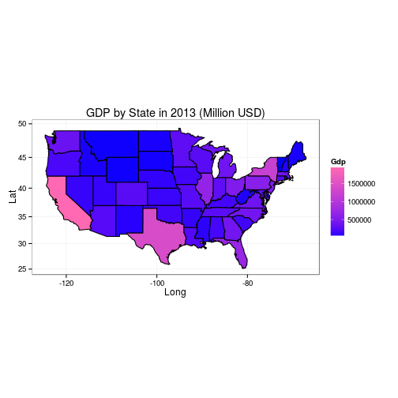

Developing Data Products: Course Project
========================================================
author: Holger Knust
date: 7/26/2015

U.S. GDP By State Explorer
========================================================
type: sub-section

The app allows the user to view and aggregate GDP levels 
by U.S. states for the time period from 1997-2013. 

The user can select all or some of the components 
(industries) that are available. The app then calculate totals 
for that year for the selctions which are then displayed on a 
map. 

The level of GDP is indicated by the color of the state.

The Application
========================================================
type: sub-section

The Shiny app is hosted on [shinyapps.io](https://hknust.shinyapps.io/Project)

### Usage
Select the desired year from the **Year** drop-down. After a selection is made, the aggregated GDP data for the selected industries is computed and the map is automatically updated.

Dataset
========================================================
type: sub-section

The dataset was downloaded from the [Bureau of Economic Analysis ](http://www.bea.gov/regional/downloadzip.cfm) site. 

Select the **AICS All GDP Components** option of the **GDP by State** drop-down. The data was filtered to just the GDP data for each state by major industry group to reduce the overall size.

Data Preview
========================================================
type: sub-section

The map below shows the aggregate GDP levels for 2013. The data is aggregated in R for the presentation and then rendered in 
ggplot.

 
